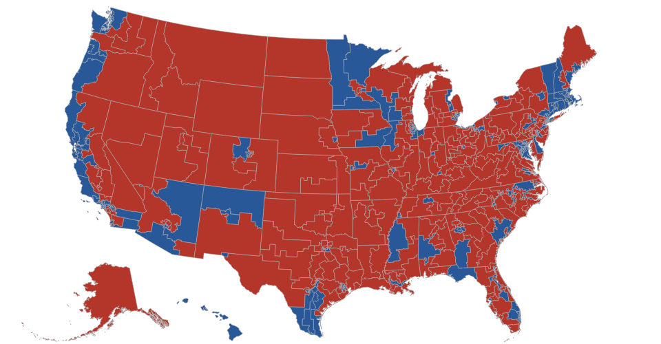

## US Congressional District Map

### Usage
```
const d3nCongress = require('d3node-congress-map');

const styles = `
.democrat {fill: blue;}
.republican {fill: #red;}
`;

const map = d3nCongress(styles);
```

## Output example

```
$ npm install
$ npm start
```

### Output (png)

